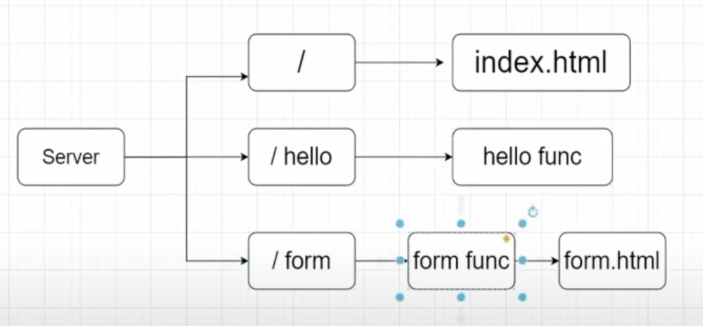

# Simple-Go-Server

This project is a simple Go web server that serves a multiple page.

## Deployment

Clone the project and start the server with this command:

```
go run main.go
```

The server will be running on http://localhost:8080

## Screenshots


